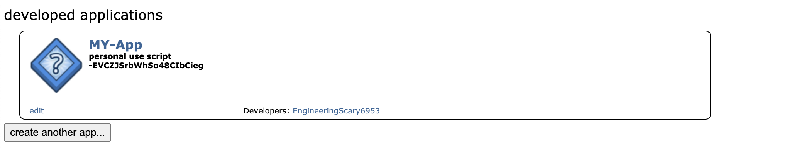
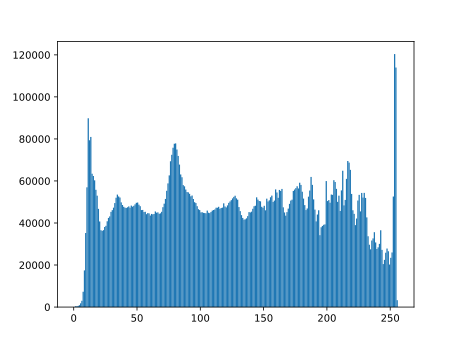
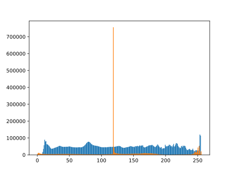
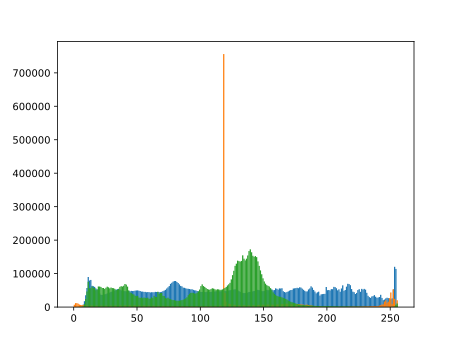
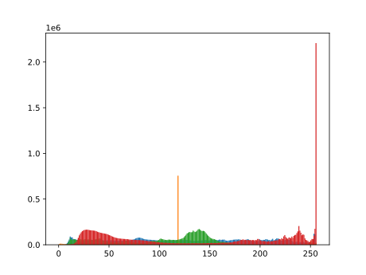
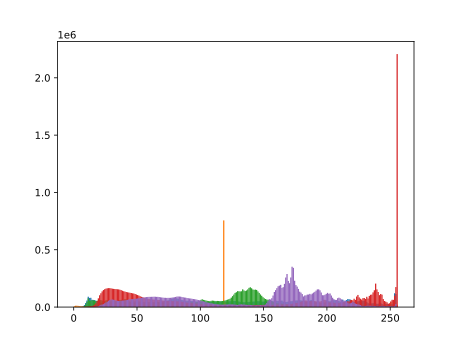

Following is the list of 20 most frequent words based on their document frequency.
{'like': 6.260943460866641e-05, 'think': 4.115339241131444e-05, 'one': 4.0098177221280736e-05, 'know': 3.271167089104481e-05, 'doctor': 3.271167089104481e-05, 'say': 2.91942869242658e-05, 'make': 2.8842548527587897e-05, 'want': 2.8842548527587897e-05, 'go': 2.8139071734232096e-05, 'see': 2.7787333337554194e-05, 'time': 2.391821097409728e-05, 'use': 2.1456042197351972e-05, 'watch': 1.9697350213962466e-05, 'show': 1.8993873420606665e-05, 'thing': 1.8642135023928763e-05, 'look': 1.8642135023928763e-05, 'episod': 1.8642135023928763e-05, 'never': 1.758691983389506e-05, 'feel': 1.723518143721716e-05, 'good': 1.723518143721716e-05}
We created an application reddit developers site.

<?xml version="1.0" encoding="utf-8" standalone="no"?>

The histograms of grayscale images are as follows:-
image1_gray.svg

image2_gray.svg

image3_gray.svg

image4_gray.svg

image5_gray.svg

